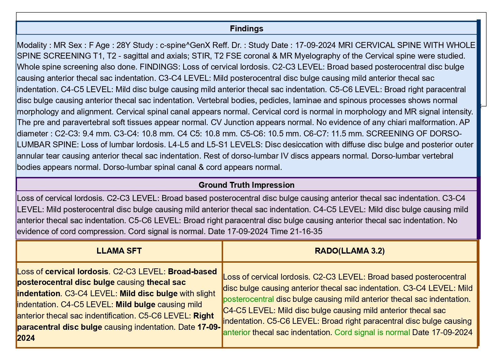

# RADO : Trustworthy Radiology Impression Generation using Safety and Faithfulness-based Preference Optimization
**Accepted in ACM Transactions on Computing for  Healthcare** 

<p align="center">
  
</p>


## Dataset

- **RIB**: Provided in `data.zip`. The dataset contains open-ended medical reasoning questions with a single verifiable answer across **13 languages**.  
  Unzip `data.zip` before running training or evaluation.

  


## Installation

This repository uses [uv](https://github.com/astral-sh/uv) for fast Python dependency management. To install all required packages, simply run:

```bash
uv sync
```

## Usage

All main scripts for model training, inference, and reward calculation are in the `codes/` folder. To run any script, update the model and data paths as needed inside the script, then execute:

```bash
python codes/<script_name>.py
```

For example:

```bash
python codes/model_finetuning.py
```

## Repository Structure

```
├── codes/
│   ├── baselines_score_calculation.py      # Baseline score calculation scripts
│   ├── dpo.py                              # DPO training script
│   ├── model_inference.py                  # Model Inference script
│   ├── model_finetuning.py                 # Model finetuning script
│   ├── reward_score_generation.py          # Reward score generation
│   ├── reward_score_merger.py              # Reward score merging
│   └── severity_reward_model_training.py   # Severity reward model training script
│
├── datasets/
│   ├── fbr_train.csv                      # Training data for reward model
│   ├── fbr_val.csv                        # Validation data for reward model
│   ├── fbr_test.csv                       # Test data for reward model
│   ├── instruct_train.csv                 # Training data for finetuning models (RIB Train)
│   └── instruct_test.csv                  # Test data (RIB Test)
│
├── Image/
│   ├── RADO_final_page-0001.jpg           # Main paper image
│   ├── RADO_final.pdf                     # Paper PDF
│   ├── RADO_Qualitative_Analysis.jpg      # Qualitative analysis image
│   └── temp/                              # Temporary images
│
├── pyproject.toml
├── README.md
```


## About the Paper
RADO is a novel framework for radiology impression generation that integrates safety, faithfulness, and linguistic refinement rewards for preference optimization. To support robust evaluation, we introduce RIB, a radiologist-curated benchmark of 2,800 annotated CT and MRI findings and impressions across 27 study types. RADO achieves state-of-the-art performance across automatic and human evaluation metrics, demonstrating improved factual consistency, reduced omissions, and higher clinical relevance — advancing the safety and reliability of generative AI in high-stakes medical applications.

## Contributions

- RIB Dataset: 2,800 expert-annotated radiology reports across 27 study types, built with structured clinical guidelines and multi-stage quality control.
- RADO Framework: Expert-informed reward models targeting key failure modes — fabrication, severity misclassification, terminology errors, and omissions — through calibrated safety, faithfulness, and linguistic components.
- Empirical Evaluation: Rigorous assessment combining automated metrics and human evaluation by radiology interns supervised by experienced radiologists, demonstrating improvements in factual consistency, reduced omissions, and clinical relevance.

## Evaluation Results

| Model | Rouge-1 | Rouge-2 | Rouge-L | Bert Score | SummaCC | FactCC |
|-------|---------|---------|---------|------------|---------|--------|
| GPT-4o(mini) | 38.04 | 24.77 | 31.54 | 0.76 | 28.64 | 23.26 |
| GPT-4o | 42.89 | 30.19 | 37.21 | 0.79 | 32.21 | 47.87 |
| LLAMA-3-70B | 41.71 | 30.49 | 37.10 | 0.79 | 31.89 | 47.17 |
| Qwen-72B | 45.78 | 34.70 | 41.13 | 0.79 | 38.01 | 53.20 |
| Phi3-medium-instruct | 26.9 | 14.10 | 22.28 | 0.72 | 24.58 | 44.20 |
| Phi3-mini-instruct (10 shot) | 28.92 | 15.17 | 24.1 | 0.73 | 25.83 | 50.96 |
| Phi3-mini-instruct (SFT) | 46.18 | 39.16 | 44.51 | 0.80 | 51.65 | 47.43 |
| **RADO(Phi3-mini)** | **52.08** | **45.08** | **54.18** | **0.83** | **51.85** | **54.5** |
| Qwen-2 1.5B (10 shot) | 26.97 | 17.81 | 23.06 | 0.70 | 29.34 | 42.92 |
| Qwen-2 1.5B (SFT) | 52.21 | 44.82 | 50.50 | 0.85 | 50.50 | 48.61 |
| **RADO(Qwen2-1.5B)** | **55.9** | **48.21** | **54.18** | **0.85** | **52.10** | **57.41** |
| LLAMA 3.2 3B (10 shot) | 29.02 | 18.10 | 24.79 | 0.71 | 28.10 | 40.05 |
| LLAMA 3.2 3B (SFT) | 50.76 | 43.12 | 48.94 | 0.84 | 52.34 | 50.34 |
| **RADO(LLAMA 3.2 3B)** | **56.30** | **48.34** | **54.24** | **0.85** | **52.49** | **61.43** |
| RADO(LBR) | 53.2 | 45.1 | 51.2 | 0.84 | 51.74 | 55.47 |
| RADO(SBR) | 55.1 | 46.7 | 53.4 | 0.85 | 51.85 | 56.28 |
| RADO(FBR) | 55.31 | 47.5 | 54.14 | 0.85 | 51.89 | 56.32 |
| RADO(RLOO) | 54.16 | 46.61 | 52.12 | 0.84 | 51.25 | 59.57 |
| RADO(PPO) | 55.34 | 47.8 | 54.10 | 0.84 | 51.56 | 60.45 |


## Qualitative Analysis

<p align="center">
  
</p>

