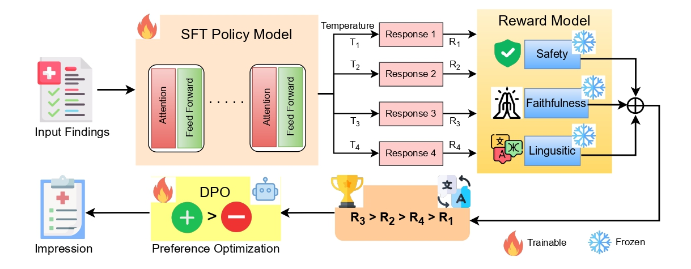

# RADO : Trustworthy Radiology Impression Generation using Safety and Faithfulness-based Preference Optimization
**Accepted in ACM Transactions on Computing for  Healthcare** 

  

## Dataset

- **RIB**: Provided in `data.zip`. The dataset contains open-ended medical reasoning questions with a single verifiable answer across **13 languages**.  
  Unzip `data.zip` before running training or evaluation.

- **Hugging Face**: RIB is also available on Hugging Face:  
  
